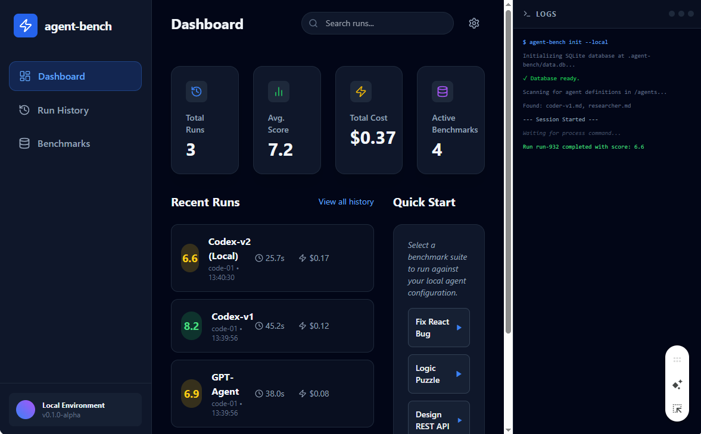

# Agent-Bench Framework

## 1. Vision & Zielsetzung

Wir entwickeln agent-bench, ein modulares Benchmarking-System für KI-Agenten. Das Kernproblem heutiger Agenten-Entwicklung ist "Regressions-Unsicherheit": Ein verbesserter Prompt in Bereich A führt oft zu Verschlechterungen in Bereich B.

agent-bench löst dieses Problem, indem es Agenten-Konfigurationen gegen eine Suite von reproduzierbaren Aufgaben testet und einen objektiven Score (0-10) liefert. Es ist das "Unit-Testing für Agenten-Prompts".

## 2. Produktvision & Strategie

Der Standard für Agenten-Qualität: agent-bench soll das Go-to-Tool für Entwickler werden, um die Zuverlässigkeit ihrer Agenten lokal zu verifizieren, bevor sie in Produktion gehen.

Vom CLI zum Ökosystem: Start als hocheffizientes CLI-Tool für Power-User, erweiterbar um eine visuelle Analyse-Schicht (Web-UI) für den Vergleich komplexer Artefakte.

Datengetriebene Iteration: Weg von "Gefühlten Verbesserungen" hin zu harten Metriken (Latenz, Kosten, Erfolgsrate, Code-Qualität).

## 3. Produktanforderungen (Requirements)

R1: Core-Engine (CLI)

Agent-Loader: Unterstützung für verschiedene Agent-Definitionen (System-Prompts, Tool-Sets).

Benchmark-Runner: Parallele oder sequentielle Ausführung von Test-Suiten.

Isolation: Ausführung von Agenten-Code in einer gesicherten Umgebung (Sandbox).

State-Persistence: Speicherung jedes Durchlaufs in einer lokalen Datenbank (z. B. SQLite).

R2: Scoring & Evaluation

Gewichtetes Scoring: Einstellbare Gewichtung zwischen automatischen Tests (60%), LLM-Judge (30%) und Performance-Metriken (10%).

LLM-Judge-Integration: Nutzung eines stabilen Modells (z. B. GPT-4o), um die "Eleganz" und "Struktur" des Outputs zu bewerten.

Regression-Alert: Automatische Warnung, wenn ein neuer Run schlechter abschneidet als der bisherige Bestwert.

R3: Artefakt-Management

Snapshotting: Speicherung des kompletten Dateisystems nach dem Agenten-Run.

Log-Aggregation: Zusammenführung von Agent-Gedankengängen (Reasoning), API-Calls und Terminal-Outputs.

## 4. UI-Anforderungen & Visualisierung

Das System benötigt eine Web-Oberfläche zur Analyse der Ergebnisse.

UI-Komponenten:

Dashboard: Leaderboard der Agenten-Versionen.

Run-Explorer: Detailansicht eines spezifischen Durchlaufs inklusive Dateibrowser für Artefakte.

Diff-Viewer: Visueller Vergleich zwischen zwei Runs (Was hat Agent B anders gemacht als Agent A?).

Referenz-Screenshot (Current Build v0.1.0):

Beschreibung des aktuellen UI-Standes:
Die App verfügt über eine Sidebar zur Navigation (Dashboard, History, Benchmarks), ein zentrales Statistik-Panel für Durchschnitts-Scores und Kosten sowie ein integriertes Live-Terminal auf der rechten Seite, das den Fortschritt der Sandbox-Isolation und Evaluation in Echtzeit visualisiert.

### Mockup

## 5. Kern-Prinzipien für den Agenten (Codex)

Der Agent soll ein System entwerfen, das folgende Kriterien erfüllt:

Entkopplung: Trenne die Agent-Definition (Prompts, Tools, Modelle) strikt von der Benchmark-Definition (Tasks, Evaluation-Logic).

Artefakt-First: Jeder Testlauf muss eine "Blackbox-Aufzeichnung" hinterlassen.

Minimalistischer Tech-Stack: TypeScript/Node, SQLite, Commander.js, Tailwind für die UI.

## 6. Strategische Workflows

The Run: Agent liest Aufgabe -> Interaktion mit isolierter Umgebung -> Ergebnis-Produktion.

The Score: Automatische Bewertung durch Unit-Tests + LLM-Judge.

The Comparison: Vergleich von agent-v1.md vs agent-v2.md -> Performance Change: +/- X.X.

The Visibility: Visualisierung via agent-bench ui.

## 7. Gewünschter Output

Ein fertiges CLI-Tool und Web UI zum automatisierten Benchmarking und Testen von versch. Agents.md.
